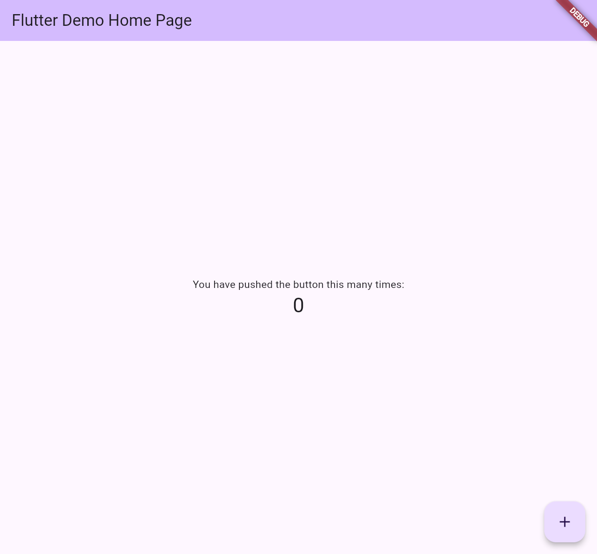
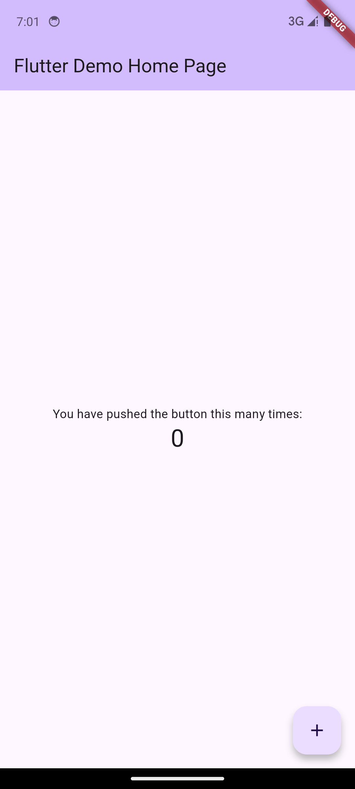
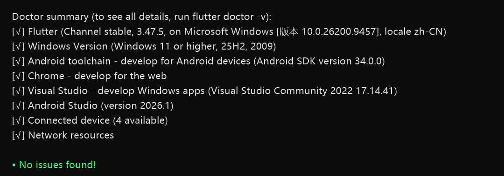

# hello_world

我的第一个 Flutter 应用，实现在 Web 端和 Android 模拟器上运行。

## 运行方式

### Web 端
```bash
flutter run -d chrome
```

### Android 模拟器
```bash
flutter emulators --launch Pixel_6_API_34
flutter run -d emulator-5554
```

## 运行截图

### Web 端


### Android 模拟器


### 开发环境（flutter doctor 全绿）

